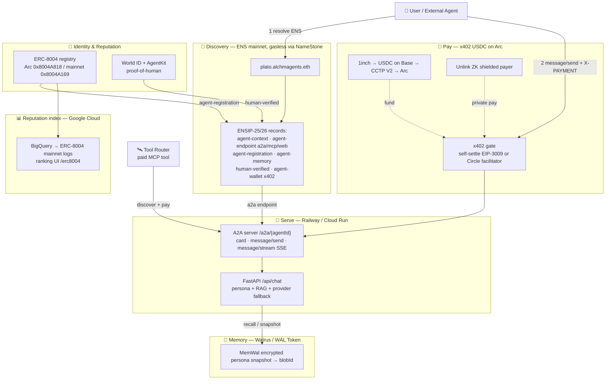
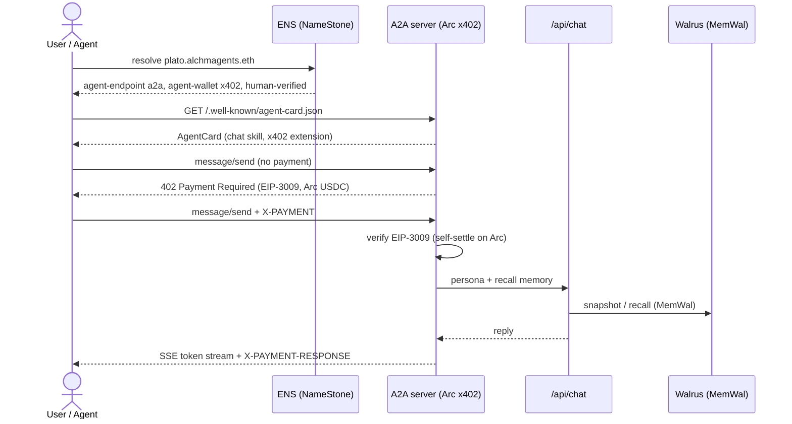
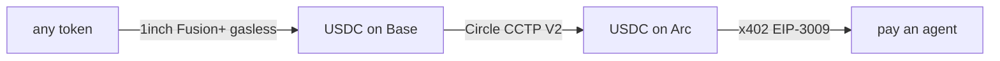

# AlchmAgents — On-Chain & Agent-Economy Integrations

> **Thesis:** a **World ID‑verified human** operates **ENS‑named agents** that **settle x402 USDC on a single chain (Arc)**, are **discoverable + payable** (A2A, Tool Router), carry **encrypted memory on Walrus**, and surface in a **BigQuery reputation leaderboard**.

This is the canonical map: **bounty → what we built → files → how to demo**. Status legend:

|     | meaning                                                                        |
| --- | ------------------------------------------------------------------------------ |
| ✅  | **runtime‑verified** — actually executed                                       |
| ☑️  | **compile‑verified** — `tsc`/`py_compile` clean; needs a key/chain to run live |
| 🔑  | needs **your** key/account/domain to run live (code + env placeholders are in) |

---

## Architecture



## End‑to‑end flow (the live demo loop)



---

## Bounty map

| Bounty                      | What we built                                                                                                                                                                                            | Status                                 |
| --------------------------- | -------------------------------------------------------------------------------------------------------------------------------------------------------------------------------------------------------- | -------------------------------------- |
| **ENS**                     | Gasless offchain subnames (`*.alchmagents.eth`) + ENSIP‑25/26 records (incl. custom `agent-memory`, `human-verified`, `agent-wallet[x402]`). ERC‑7930 encoder reproduces the spec example byte‑for‑byte. | ✅ dry‑run + encoder; 🔑 domain enable |
| **A2A** (AAIF/Google)       | One server, per‑agent card at `/a2a/{id}/.well-known/agent-card.json`, `message/send` + incremental `message/stream` (SSE).                                                                              | ✅ runtime‑verified (a2a‑sdk 1.1.0)    |
| **Google Cloud — BigQuery** | Ranking app over the **mainnet** ERC‑8004 registry: SQL generator (partition‑pruned) + indexer + leaderboard UI; highlights x402‑payable + reputation/validation.                                        | ✅ SQL/decode; 🔑 GCP creds            |
| **Walrus + WAL Token**      | Encrypted persona memory (MemWal) with native **WAL Token Staking** to fund agent storage capacity; blobId → ENS `agent-memory`.                                                                         | ✅ **live testnet write/read**         |
| **Circle / Arc**            | Single‑chain x402 on Arc — **self‑settle** EIP‑3009 (`LocalArcFacilitator`) or Circle's facilitator. ERC‑8004 register on Arc.                                                                           | ✅ EIP‑3009 verify; 🔑 operator wallet |
| **World** (ID + AgentKit)   | World ID proof‑of‑personhood gate + `human-verified` ENS/A2A badge; AgentKit proof‑of‑human for x402.                                                                                                    | ☑️ verify backend; 🔑 World app        |
| **Dynamic**                 | Operator auth/wallet (existing `@dynamic-labs/*`); Privy server wallet kept as agent signer.                                                                                                             | existing                               |
| **1inch**                   | Fusion+ quote (swap → USDC on Base) + CCTP V2 bridge → Arc.                                                                                                                                              | ☑️ proxy/quote; 🔑 1inch key           |
| **Unlink**                  | ZK‑shielded throwaway payer → signs x402 EIP‑3009 (unlinkable).                                                                                                                                          | ☑️ flow; 🔑 `@canary` SDK              |
| **Tool Router**             | Register agent‑chat as a paid MCP tool (parameterized).                                                                                                                                                  | ✅ manifest gen; 🔑 onboarding         |

---

## Files by integration (all paths verified)

### ERC‑8004 + BigQuery (Google Cloud)

| File                                                                                                                  | Purpose                                                                                   |
| --------------------------------------------------------------------------------------------------------------------- | ----------------------------------------------------------------------------------------- |
| [lib/erc8004/registry.ts](lib/erc8004/registry.ts)                                                                    | Addresses (mainnet + Arc), verbatim v2.0.0 ABIs, event topic0s, id helpers, `ARC_TESTNET` |
| [lib/erc8004/bigquery-queries.ts](lib/erc8004/bigquery-queries.ts)                                                    | SQL generator — partition‑pruned, `SUBSTR`/`FROM_HEX` decode, named params                |
| [lib/erc8004/bigquery-indexer.ts](lib/erc8004/bigquery-indexer.ts)                                                    | Runs queries, viem‑decodes logs, builds the ranking leaderboard                           |
| [lib/erc8004/registration-file.ts](lib/erc8004/registration-file.ts)                                                  | Agent "homepage" JSON (`x402Support`/`active`/`supportedTrust`/`services`)                |
| [app/api/erc8004/registry/route.ts](app/api/erc8004/registry/route.ts) · [app/erc8004/page.tsx](app/erc8004/page.tsx) | Ranking API + leaderboard UI                                                              |
| [lib/erc8004/README.md](lib/erc8004/README.md)                                                                        | Module docs                                                                               |

```bash
bun run scripts/index-erc8004-registry.ts --type registrations --sql   # print SQL, no creds
bun run scripts/index-erc8004-registry.ts --type leaderboard --limit 25 # live (needs GCP creds)
```

### ENS / NameStone (+ ENSIP‑25/26)

| File                                                                                 | Purpose                                                                                 |
| ------------------------------------------------------------------------------------ | --------------------------------------------------------------------------------------- |
| [lib/namestone.ts](lib/namestone.ts)                                                 | NameStone client (`/api/public_v1`): setSubname/bulkSetSubnames(50)/getNames/deleteName |
| [lib/erc8004/ensip.ts](lib/erc8004/ensip.ts)                                         | ENSIP‑25/26 keys + ERC‑7930 encoder + `buildAgentTextRecords`                           |
| [app/api/agents/register-subname/route.ts](app/api/agents/register-subname/route.ts) | POST `{agentId, subname, address}`                                                      |
| [scripts/register-all-agents-ens.ts](scripts/register-all-agents-ens.ts)             | Batch‑assign subnames (historical / all)                                                |

```bash
bun run scripts/register-all-agents-ens.ts --set historical --dry-run
```

> One‑time on‑chain step: point `alchmagents.eth`'s ENS resolver at NameStone's resolver `0xA87361C4E58B619c390f469B9E6F27d759715125`, then enable the domain.

### ERC‑8004 register client (on‑chain mint)

| File                                                                   | Purpose                                                                            |
| ---------------------------------------------------------------------- | ---------------------------------------------------------------------------------- |
| [lib/erc8004/register-client.ts](lib/erc8004/register-client.ts)       | `registerAgent()` via `register(agentURI)` (Privy wallet or viem key); default Arc |
| [scripts/register-agent-onchain.ts](scripts/register-agent-onchain.ts) | Mint one agent (`--network`, `--ens`, `--dry-run`)                                 |

```bash
bun run scripts/register-agent-onchain.ts --agent plato --dry-run
```

### A2A + x402 + Arc self‑settle (backend)

| File                                                                                                    | Purpose                                                                               |
| ------------------------------------------------------------------------------------------------------- | ------------------------------------------------------------------------------------- |
| [backend/a2a_server.py](backend/a2a_server.py)                                                          | A2A server — per‑agent card + chat skill, wraps in‑process `/api/chat`, SSE streaming |
| [backend/x402_middleware.py](backend/x402_middleware.py)                                                | Self‑contained x402 gate on `/a2a/`; branches to self‑settle or facilitator           |
| [backend/arc_facilitator.py](backend/arc_facilitator.py)                                                | `LocalArcFacilitator` — EIP‑3009 verify + `transferWithAuthorization` on Arc USDC     |
| [backend/smoke_test_a2a.py](backend/smoke_test_a2a.py) · [backend/A2A_README.md](backend/A2A_README.md) | Smoke test + docs                                                                     |

```bash
# Local verify (a2a-sdk needs Python >=3.10):
uv venv --python 3.11 .venv && source .venv/bin/activate
uv pip install 'a2a-sdk[fastapi]' httpx
cd backend && PYTHONPATH=. python smoke_test_a2a.py   # → card 200; stream 7 SSE events
```

### Walrus memory (MemWal)

| File                                                                                                            | Purpose                                                                  |
| --------------------------------------------------------------------------------------------------------------- | ------------------------------------------------------------------------ |
| [lib/walrus/memory.ts](lib/walrus/memory.ts)                                                                    | writeMemory/recallMemory/readBlob — MemWal encrypted + raw‑HTTP fallback |
| [lib/walrus/persona-snapshot.ts](lib/walrus/persona-snapshot.ts) · [lib/walrus/recall.ts](lib/walrus/recall.ts) | Persona snapshot + chat recall/write‑back                                |

```bash
bun run scripts/snapshot-persona-walrus.ts --agent plato   # ✅ live testnet (no creds)
```

### World ID + AgentKit

| File                                                                                                                                            | Purpose                                     |
| ----------------------------------------------------------------------------------------------------------------------------------------------- | ------------------------------------------- |
| [lib/worldid/verify.ts](lib/worldid/verify.ts)                                                                                                  | Cloud verify (pure fetch)                   |
| [lib/worldid/agentkit.ts](lib/worldid/agentkit.ts)                                                                                              | AgentKit proof‑of‑human resolver (lazy SDK) |
| [app/api/world-id/verify/route.ts](app/api/world-id/verify/route.ts) · [components/world/WorldIdButton.tsx](components/world/WorldIdButton.tsx) | Verify route + IDKit button                 |

```bash
bun run scripts/register-agentkit.ts <agent-wallet>   # prints AgentBook register steps
```

### 1inch onramp · Unlink · Tool Router

| File                                                                                                                               | Purpose                                                     |
| ---------------------------------------------------------------------------------------------------------------------------------- | ----------------------------------------------------------- |
| [lib/onramp/oneinch.ts](lib/onramp/oneinch.ts) · [lib/onramp/cctp.ts](lib/onramp/cctp.ts) · [route](app/api/onramp/quote/route.ts) | Fusion+ quote → Base USDC → CCTP → Arc                      |
| [lib/unlink/shielded-payer.ts](lib/unlink/shielded-payer.ts)                                                                       | ZK shielded throwaway payer (lazy `@unlink-xyz/sdk@canary`) |
| [lib/toolrouter/manifest.ts](lib/toolrouter/manifest.ts) · [scripts/register-toolrouter.ts](scripts/register-toolrouter.ts)        | Paid‑MCP‑tool manifest + onboarding steps                   |

```bash
bun run scripts/register-toolrouter.ts   # emits the Tool Router manifest
```



### Pentacles Star Vaults & Agent Minigame Endpoints

| File                                                                                     | Purpose                                                                 |
| ---------------------------------------------------------------------------------------- | ----------------------------------------------------------------------- |
| [app/(app)/pentacles/page.tsx](<app/(app)/pentacles/page.tsx>)                           | Pentacle Star Vaults sky map, zone pools & Arc staking UI               |
| [app/api/agents/word-duel/route.ts](app/api/agents/word-duel/route.ts)                   | Word Duels of the Spheres agent "brain" API for Pentacles companion     |
| [app/api/agents/jing/route.ts](app/api/agents/jing/route.ts)                             | Jing Arena elemental counter-move API for Pentacles companion           |
| [app/api/staking/claim-attestation/route.ts](app/api/staking/claim-attestation/route.ts) | EIP-712 StarYield attestation server for Arc `StarVault.claimYield`     |
| [scripts/run-agent-pentacles.ts](scripts/run-agent-pentacles.ts)                         | 3-loop autonomous agent player (staking, auto-siege, inter-agent duels) |

---

## Setup & env checklist

Install: `bun install` · `cd backend && pip install -r requirements.txt` (now includes `web3`).
New deps declared: `@worldcoin/idkit`, `@worldcoin/agentkit`, `@unlink-xyz/sdk@0.3.0-canary.598`, `@google-cloud/bigquery`.

Fill in `.env` (placeholders are present; values redacted here):

| Var(s)                                                                                                                                       | For                     | Have?     |
| -------------------------------------------------------------------------------------------------------------------------------------------- | ----------------------- | --------- |
| `GOOGLE_CLOUD_PROJECT` + `GOOGLE_APPLICATION_CREDENTIALS`                                                                                    | BigQuery ranking        | 🔑        |
| `NAMESTONE_API_KEY` (set) + `NAMESTONE_DOMAIN` + resolver/enable                                                                             | ENS subnames            | 🔑 domain |
| `X402_SELF_SETTLE=true` · `X402_NETWORK=eip155:5042002` · `X402_ASSET=0x3600…` · `X402_PAY_TO` · `ARC_OPERATOR_PRIVATE_KEY` (Arc USDC = gas) | x402 self‑settle on Arc | 🔑        |
| `ARC_TESTNET_CHAIN_ID=5042002` · `ARC_TESTNET_RPC_URL=https://rpc.testnet.arc.io`                                                            | Arc                     | ✅ set    |
| `NEXT_PUBLIC_WORLD_APP_ID` (staging set) + `NEXT_PUBLIC_WORLD_ACTION`                                                                        | World ID                | 🔑        |
| `ONEINCH_API_KEY` · `CCTP_ARC_DOMAIN` (confirm 26 vs 7)                                                                                      | onramp                  | 🔑        |
| `MEMWAL_PRIVATE_KEY` + `MEMWAL_ACCOUNT_ID` (optional — HTTP fallback works without)                                                          | encrypted memory        | optional  |
| `AGENTKIT_WALLET_ADDRESS` · `UNLINK_NETWORK`                                                                                                 | AgentKit / Unlink       | 🔑        |

---

## Demo script (5 minutes)

1. **Discover** — `bun run scripts/register-all-agents-ens.ts --set historical --dry-run` → shows `plato.alchmagents.eth` + its ENSIP records (incl. `agent-endpoint[a2a]`, `human-verified`).
2. **Serve + stream** — boot the backend (Py 3.11) and `python backend/smoke_test_a2a.py` → card 200 + **7 SSE events** of true token streaming.
3. **Pay on Arc** — with `X402_SELF_SETTLE=true` + a funded operator key, `message/send` → 402 → pay → EIP‑3009 self‑settled on Arc → reply.
4. **Memory** — `bun run scripts/snapshot-persona-walrus.ts --agent plato` → real Walrus testnet `blobId` (read it back from the aggregator).
5. **Rank** — open `/erc8004` → BigQuery leaderboard of x402‑payable, reputation‑ranked agents.
6. **Human** — World ID button → `human-verified` badge written to the agent's ENS record.

---

## Verification status

- ✅ **Runtime‑verified:** A2A card/send/stream (a2a‑sdk 1.1.0), Walrus persona write+read (live testnet), Arc EIP‑3009 verify (web3 self‑test), ERC‑7930 encoder (byte‑exact), BigQuery SQL generation, Tool Router manifest, ENS dry‑runs, recall no‑op.
- ☑️ **Compile‑verified (needs key/chain to run):** BigQuery live query (GCP creds), Arc settle tx (operator key), World ID live verify, 1inch quote (key), register mint (funded wallet), AgentKit/Unlink (SDK install).
- See [memory: onchain-architecture] for the full build/verification log.
