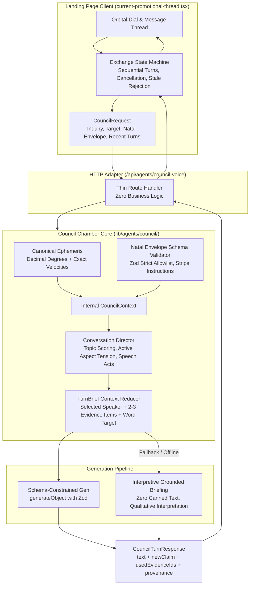

# Council Conversation Architecture & Evaluated Dialogue System

**Campaign Specification & Implementation Plan**  
**Document Version:** 2.0.0 (Hardened)  
**Target Repository:** `AlchmAgentsSolana`

---

## 1. Executive Summary & Problem Diagnosis

The Current Sky Council features 10 classical planetary delegates and Host Gregory Castro holding a round table. Prior iterations improved persona phrasing, but the underlying mechanics suffered from four severe architectural flaws:

1. **Disconnected Context & Laundry-List Regurgitation:** Live ephemeris was floored to integers, velocities were omitted, and `skyContext` was calculated in the client and never consumed. Conversely, when context was sent, models were tempted to recite placement degrees and dignity labels ("Wandering peregrine...", "Stationed in my fall...") rather than offering qualitative interpretations.
2. **Deterministic Fallbacks Masquerading as AI:** Missing API keys or network errors silently triggered canned strings from `planetaryClaim()` with generic openers from `addressPreviousSpeaker()`, returning `{ success: true }` without provenance.
3. **Arbitrary Sequencing & Repetitive Ingress:** Autonomous turns selected speakers via `Math.random()`, user inquiries arbitrarily defaulted to Moon/Sun then Mercury, and simulated ingress fired 10 redundant turns for every single degree shift.
4. **Unsymmetric Relative-Motion Geometry:** Aspect applying/separating phases only checked body A's direction, producing contradictory states where an aspect was "applying" from planet A but "separating" from planet B.

---

## 2. Architecture Overview



---

## 3. Detailed Architectural Specifications (14 Adjustments)

### 3.1 Frozen Ephemeris Fixture ("Screenshot Sky")

- **Canonical Timestamp:** `2026-09-09T18:06:08Z`
- **Ephemeris Source:** `VSOP87-Enhanced` (`lib/enhanced-astronomical-calculator.ts`)
- **Frozen Placements:**
  - **Sun:** Virgo 17.08° (velocity +0.97°/day, direct)
  - **Moon:** Leo 29.12° (velocity +12.45°/day, direct, ingressing into Virgo)
  - **Mercury:** Virgo 28.43° (velocity +1.64°/day, direct, Domicile & Exaltation)
  - **Venus:** Libra 29.61° (velocity +1.15°/day, direct, Domicile)
  - **Mars:** Cancer 18.89° (velocity +0.60°/day, direct, Fall)
  - **Jupiter:** Leo 15.53° (velocity +0.18°/day, direct)
  - **Saturn:** Aries 13.22° (velocity -0.04°/day, retrograde, Fall)
  - **Uranus:** Gemini 5.70° (velocity +0.02°/day, direct)
  - **Neptune:** Aries 3.43° (velocity -0.01°/day, retrograde)
  - **Pluto:** Aquarius 3.35° (velocity -0.01°/day, retrograde)
- **Implementation File:** `test/fixtures/frozen-screenshot-sky.ts`

### 3.2 Longitudinal Velocity & Relative-Motion Aspect Symmetry

- **Velocity Exposure:** `EnhancedPlanetPosition` in `lib/enhanced-astronomical-calculator.ts` already computes physical longitudinal speed ($v = \frac{\Delta\lambda}{2\cdot\Delta t}$). Expose `speed?: number` on `CurrentPlanetPosition` in `lib/calculate-transits.ts`.
- **Symmetric Aspect Phase:** In `lib/agents/council/aspect-dialogue-engine.ts`:

  ```ts
  export function resolvePhase(
    degA: number,
    degB: number,
    definition: AspectDefinition,
    orb: number,
    speedA?: number,
    speedB?: number
  ): AspectPhase {
    if (orb <= EXACT_THRESHOLD) return 'exact'
    if (speedA === undefined || speedB === undefined) return 'unknown'

    const dt = 0.001
    const nextSep = angularSeparation(degA + speedA * dt, degB + speedB * dt)
    const nextOrb = Math.abs(nextSep - definition.angle)
    return nextOrb < orb ? 'applying' : 'separating'
  }
  ```

- **Guaranteed Invariant:** `detectAspect(A, B, vA, vB).phase === detectAspect(B, A, vB, vA).phase`.
- **Missing Velocity:** When velocity is absent, returns `phase: 'unknown'` rather than fabricating certainty.

### 3.3 Internal `CouncilContext` & Thin HTTP Adapter

- Client sends compact `CouncilRequest`:
  ```ts
  export interface CouncilRequest {
    seekerInquiry?: string
    targetDelegate?: string
    attachedNatalEnvelope?: ContextCardEnvelope | string
    ingressEvent?: { movingPlanet: string; newSign: string; newDegree: number }
    recentTurns?: CompactTurn[]
    selectedAgentFilter?: string
  }
  ```
- `CouncilChamber` (`lib/agents/council/council-chamber.ts`) privately manages the full sky state, aspect matrix, and natal contacts.
- `app/api/agents/council-voice/route.ts` is purely a thin adapter routing requests to `CouncilChamber.dispatchTurn(request)`.

### 3.4 `TurnBrief` Context Reduction

To prevent the model from regurgitating an entire astrological chart, the chamber compiles a surgical `TurnBrief`:

```ts
export interface TurnEvidenceItem {
  id: string
  label: string
  aspectName?: string
  orb?: number
}

export interface TurnBrief {
  speakerKey: BasketAgentKey
  speakerTitle: string
  targetTurn?: { speakerName: string; claim: string; turnId?: string }
  speechAct: 'support' | 'challenge' | 'qualify' | 'reframe' | 'synthesize'
  evidence:
    | [TurnEvidenceItem, TurnEvidenceItem]
    | [TurnEvidenceItem, TurnEvidenceItem, TurnEvidenceItem]
  directive: string
  wordTarget: { min: number; max: number }
  seekerInquiry?: string
}
```

The model receives ONLY this brief and the speaker's persona block.

### 3.5 Narrowed Conversation Director Responsibilities

The Director (`lib/agents/council/conversation-director.ts`) is a deterministic, heuristic orchestrator (zero LLM calls):

1. **Speaker Selection:**
   - On Ingress: 3–4 purposeful voices (nearest neighbor $\to$ tightest aspect partner $\to$ countervoice/host $\to$ moving body).
   - On Seeker Inquiry: Topically routed based on wisdom domains (discipline $\to$ Saturn/Mars, emotion $\to$ Moon/Venus, transformation $\to$ Pluto, intellect $\to$ Mercury/Uranus, vision $\to$ Jupiter, core $\to$ Sun), paired with an ideological counterpart.
   - On Autonomous Turn: Selected by aspect tension to last speaker, archetypal affinity/tension vectors (`PLANETARY_VOICES`), and recency decay.
2. **Discourse Move Assignment:** Assigns `support`, `challenge`, `qualify`, `reframe`, or `synthesize`.
3. **Evidence Selection:** Picks 2–3 salient chart facts.
4. **Turn Policy:** Sets word count target (50–90 for substantive inquiries/synthesis, 25–45 for ambient banter).
   _The speaking agent generates the claim; the director does NOT generate free-form text._

### 3.6 Structured Natal Data Envelope & Strict Zod Validation

- Primary format: versioned `ContextCardEnvelope`:
  ```ts
  export interface ContextCardEnvelope {
    version: 1
    data: ContextCardData
  }
  ```
- Legacy Markdown is parsed via `lib/context-card/natal-parser.ts` through a strict Zod allowlist schema:
  - Allowed fields: `birth.bigThree`, `points` (body, sign, deg, house, retro, dignity), `houses`, `aspects`.
  - Disallowed & Rejected: `## HOW TO USE THIS FILE`, prompt headers, and all document prose.
  - Server computes real transit-to-natal aspect contacts.

### 3.7 Schema-Constrained Generation via `generateObject`

- Uses `generateObject` with Zod:
  ```ts
  export const CouncilTurnGenerationSchema = z.object({
    text: z
      .string()
      .describe('The articulate, voiced paragraph spoken into the council round table'),
    newClaim: z
      .string()
      .describe('The single, core substantive proposition introduced in this turn'),
    usedEvidenceIds: z
      .array(z.string())
      .describe('IDs of evidence items from the brief used in this turn'),
  })
  ```
- Server validates that `usedEvidenceIds` $\subseteq$ `TurnBrief.evidence.map(e => e.id)`.

### 3.8 Sanitized Client Provenance

Client receives clean, transparent metadata:

```ts
export interface CouncilTurnProvenance {
  source: 'model' | 'grounded_briefing'
  modelFamily?: 'fast' | 'substantive'
  latencyMs?: number
}
```

Detailed provider errors, API keys, and stack traces are logged server-side and excluded from client state.

### 3.9 Interpretive Grounded Sky Briefings

When model generation fails or API credentials are unavailable:

- Delegates emit an **interpretive briefing** grounded in their current archetype, dignity posture, and active aspect tension.
- Cites evidence IDs; does NOT recite raw coordinate degrees or dignity labels into prose.
- Never falls back to canned simulated dialogue like "X names it well."

### 3.10 Decoupling Length Policy from Persona Identity

- `buildPlanetaryPersonaBlock` in `lib/agents/council/planetary-personas.ts` defines character, tone texture, contests, avoids, and dignity posture (sovereign ease, acute vigilance, friction-tested realism).
- Word counts are passed per-turn via `TurnBrief.wordTarget`.

### 3.11 Exchange State Machine

- `lib/agents/council/exchange-state-machine.ts` extracts orchestration from React:
  - Sequences turns, enforces delays, fences stale responses via UUID `exchangeId`, and manages cancellation via `AbortController`.
- `components/landing/current-promotional-thread.tsx` subscribes to state machine events (`TURN_START`, `TURN_FINISH`, `ERROR`), eliminating nested `setTimeout` callbacks.

### 3.12 Test Separation: Deterministic Vitest vs. Generative Harness

- **Deterministic Unit Tests (`test/components/council-dialogue-quality.spec.ts`):**
  - Relative-motion phase symmetry ($A \to B \equiv B \to A$).
  - Missing velocity $\to$ `phase: 'unknown'`.
  - Non-floored precision preservation.
  - Ingress 4-speaker ordering.
  - Director topical routing & speech act assignment.
  - Natal envelope validation & instruction stripping.
  - Provenance sanitization.
  - Incompatible tests (asserting dignity label recitation or character count < 350) replaced with posture and density tests.
- **Generative Evaluation Harness (`scripts/eval-council-dialogue.ts`):**
  - Frozen scenarios running offline/on-demand.
  - Blind evaluation of groundedness, novelty, and voice differentiation.

---

## 4. Implementation Phasing & Task List

### Phase 1: Canonical Astronomy, Ephemeris & Fixtures

1. Expose `speed?: number` on `CurrentPlanetPosition` in `lib/calculate-transits.ts`.
2. Update `detectAspect` / `resolvePhase` in `lib/agents/council/aspect-dialogue-engine.ts` to implement pair-relative velocity stepping and `unknown` phase fallback.
3. Eliminate degree flooring in `components/landing/current-promotional-thread.tsx:995`.
4. Create `test/fixtures/frozen-screenshot-sky.ts` with the canonical 2026-09-09T18:06:08Z data.
5. Update `test/components/council-dialogue-quality.spec.ts` to replace incompatible tests and verify aspect symmetry.

### Phase 2: Core Council Chamber & TurnBrief Reducer

1. Create `lib/agents/council/council-context.ts` (internal data types).
2. Create `lib/context-card/natal-parser.ts` (Zod schema validation, allowlist, instruction stripping).
3. Create `lib/agents/council/conversation-director.ts` (topical scoring, 3-4 speaker ingress, speech acts, evidence selector).
4. Create `lib/agents/council/turn-brief.ts` (TurnBrief compiler).
5. Create `lib/agents/council/grounded-briefing.ts` (interpretive fallback generator).

### Phase 3: Schema-Constrained Generation & Thin Route

1. Create `lib/agents/council/council-schema.ts` (Zod schemas for `generateObject`).
2. Update `lib/agents/persona/voiced-generation.ts` to add `generateStructuredCouncilTurn`.
3. Update `lib/agents/council/planetary-personas.ts` to remove length policy and verbatim dignity recitation.
4. Implement `lib/agents/council/council-chamber.ts` (`dispatchTurn`).
5. Refactor `app/api/agents/council-voice/route.ts` into a thin HTTP adapter.

### Phase 4: Exchange State Machine & Client Integration

1. Create `lib/agents/council/exchange-state-machine.ts`.
2. Update `quick-chart-attachment-generator.tsx` to store versioned `ContextCardEnvelope`.
3. Refactor `components/landing/current-promotional-thread.tsx` to use the exchange state machine and render clean provenance badges.

### Phase 5: Evaluation Harness & Final Quality Gates

1. Create `scripts/eval-council-dialogue.ts` with frozen test scenarios.
2. Run test suites:
   - `bunx vitest run test/components/council-dialogue-quality.spec.ts`
   - `bunx vitest run test/components/CurrentPromotionalThread.spec.tsx`
   - `bunx vitest run test/persona/voice-differentiation.spec.ts`
   - `bun run scripts/smoke-test-persona.ts`
   - `bun run typecheck:errors`

---

## 5. Verification Plan

| Check                   | Tool / Command                                                      | Pass Criteria                                                        |
| ----------------------- | ------------------------------------------------------------------- | -------------------------------------------------------------------- |
| Aspect Symmetry         | `bunx vitest run test/components/council-dialogue-quality.spec.ts`  | $A \to B$ phase identically matches $B \to A$ phase across all pairs |
| Unknown Velocity        | `bunx vitest run test/components/council-dialogue-quality.spec.ts`  | Missing speed outputs `phase: 'unknown'`                             |
| Ingress Council Cap     | `bunx vitest run test/components/council-dialogue-quality.spec.ts`  | Ingress returns $\le 4$ purposeful turns                             |
| Natal Schema Security   | `bunx vitest run test/components/council-dialogue-quality.spec.ts`  | Instructions stripped, chart fields allowlisted                      |
| UI Component Test       | `bunx vitest run test/components/CurrentPromotionalThread.spec.tsx` | All tests pass with state machine integration                        |
| Persona Differentiation | `bunx vitest run test/persona/voice-differentiation.spec.ts`        | Distinct style signatures and cache keys                             |
| Smoke Test              | `bun run scripts/smoke-test-persona.ts`                             | Exits 0, valid persona blocks                                        |
| TypeScript Health       | `bun run typecheck:errors`                                          | Zero new type errors introduced                                      |
