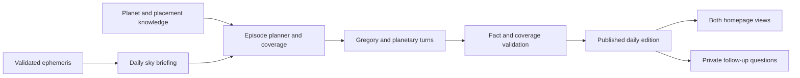

# Planetary group chat: quality audit and daily council design

**Date:** October 1, 2026  
**Inspected revision:** `95a38e0`  
**Scope:** Both planetary council components rendered on the homepage, their generation paths, sky data, placement knowledge, Gregory Castro's persona, fallbacks, and tests. This is a research deliverable; application behavior has not been changed.

## Finding

The main weakness is the connection between data, knowledge, conversation direction, and delivery. Better wording alone will not achieve the intended experience. The homepage has two independent councils; one has a broken sky request contract, while the other supplies a thin planetary prompt and no explicit shared sky snapshot. Gregory is absent from one and structurally excluded from most turns in the other.

The recommended product is a **published daily conversation hosted by Gregory**, backed by a validated sky briefing and a coverage plan. A visitor should immediately be able to read a complete edition. Personal questions and updates can extend it, without replacing its account of the day.

## 1. What is actually active

| Homepage surface                                                                                                           | Generation path                                                                                                        | Existing strengths                                                                                                                     | Principal gaps                                                                                                                                              |
| -------------------------------------------------------------------------------------------------------------------------- | ---------------------------------------------------------------------------------------------------------------------- | -------------------------------------------------------------------------------------------------------------------------------------- | ----------------------------------------------------------------------------------------------------------------------------------------------------------- |
| Current Sky Chat, mounted at [app/page.tsx:819](/Users/cookingwithcastro/Desktop/AlchmAgentsSolana/app/page.tsx:819)       | `CurrentSkyChat` → `ExchangeStateMachine` → `/api/agents/council-voice` → `dispatchTurn` → structured voice generation | Ten planets, canonical CraftedAgent personas, shared aspect engine, targeted claims, evidence IDs, cancellation, generation provenance | Incompatible sky keys, authentication restriction for visitors, static opening, limited turn evidence, little Gregory participation, no daily coverage plan |
| Live Planetary Council, mounted at [app/page.tsx:903](/Users/cookingwithcastro/Desktop/AlchmAgentsSolana/app/page.tsx:903) | `LivePlanetaryCouncilThread` → `/api/unified-multi-agent-chat` → FastAPI `backend.agents.chat`                         | Sequential responses and prior agent history reach subsequent turns                                                                    | Only two speakers, no Gregory, Sun–Saturn roster, thin prompt, missing explicit sky context, billing-dependent auto-seed, incomplete SSE consumption        |

The previous conversation campaign targeted Current Sky Chat and remains relevant to that surface. It does not fix the second component. Historical campaign claims must be checked against today's code; neither component is a server-published daily edition.

Model routing is also split. The smaller card sends ordinary turns to the backend's `free` tier; the larger card uses `generateStructuredVoice` with substantive selection for hosts/questions and ambient selection otherwise. The unified route's `selectOptimalModel` helper is not called by its regular planetary response path. Tune the active generation functions and verify the actual selected provider during evaluation. Detailed routing, persistence, and cache evidence is captured in the [runtime research companion](/Users/cookingwithcastro/Desktop/AlchmAgentsSolana/docs/development/planetary-group-chat-runtime-research-2026-10-01.md).

## 2. Prioritized weaknesses

### P0 — Repair the sky contract and stop inventing missing placements

Current Sky Chat builds a map with `Sun`, `Moon`, etc. at [current-promotional-thread.tsx:1023](/Users/cookingwithcastro/Desktop/AlchmAgentsSolana/components/landing/current-promotional-thread.tsx:1023). The API schema requires `sun`, `moon`, etc. at [council-schema.ts:122](/Users/cookingwithcastro/Desktop/AlchmAgentsSolana/lib/agents/council/council-schema.ts:122). All three exchange types supply this map. After authentication, normal client payloads fail validation before generation.

Simply lowercasing the map is also wrong: [council-context.ts:151](/Users/cookingwithcastro/Desktop/AlchmAgentsSolana/lib/agents/council/council-context.ts:151) reads Titlecase names and substitutes missing bodies with Aries at zero degrees.

An offline diagnostic using the repository's frozen sky fixture confirmed:

| Input/check                                  | Observed result                                                   |
| -------------------------------------------- | ----------------------------------------------------------------- |
| Titlecase client-shaped map → request schema | Rejected: `skyOverride must provide all 10 core planetary bodies` |
| Lowercase map → request schema               | Accepted                                                          |
| Accepted lowercase map → context builder     | Fixture Sun in Virgo becomes Aries at zero degrees                |
| Resulting aspects                            | 45 fabricated conjunctions among the ten planets                  |

Use one typed adapter and one canonical body-key convention across the client, schema, context, and fixtures. Missing data must produce an explicit incomplete state, never a substitute placement. Public editions should use server-owned snapshots; simulations should have a clearly identified preview context.

### P0 — An onlooker cannot reliably receive the promised experience

The newer route requires a user or service at [council-voice/route.ts:14](/Users/cookingwithcastro/Desktop/AlchmAgentsSolana/app/api/agents/council-voice/route.ts:14). The state machine throws on non-success responses at [exchange-state-machine.ts:200](/Users/cookingwithcastro/Desktop/AlchmAgentsSolana/lib/agents/council/exchange-state-machine.ts:200), while the UI's error handler only clears activity state at [current-promotional-thread.tsx:1106](/Users/cookingwithcastro/Desktop/AlchmAgentsSolana/components/landing/current-promotional-thread.tsx:1106). An anonymous visitor retains the static introductory lines rather than receiving an informative edition.

The older card auto-seeds through a standard consultation route. Unless every selected agent qualifies for the weekly free rotation, it requires authentication and can debit a signed-in user's balance: [unified-multi-agent-chat/route.ts:260](/Users/cookingwithcastro/Desktop/AlchmAgentsSolana/app/api/unified-multi-agent-chat/route.ts:260). Its error copy attributes failures to celestial alignment rather than explaining authentication, credits, rate limits, or connectivity: [live-planetary-council-thread.tsx:491](/Users/cookingwithcastro/Desktop/AlchmAgentsSolana/components/landing/live-planetary-council-thread.tsx:491).

Publish a cached public edition through a read-only endpoint. Generate it once under controlled server credentials. Keep interactive consultation and its billing separate from viewing. Preserve authentication on model-generation endpoints.

### P0 — Cached and mock replies can remain blank

The unified route returns a completed response on a cache hit or mock generation without emitting text chunks: [unified-multi-agent-chat/route.ts:604](/Users/cookingwithcastro/Desktop/AlchmAgentsSolana/app/api/unified-multi-agent-chat/route.ts:604). The route does emit `agent_complete`, but the landing card only consumes `agent_start` and `text`: [live-planetary-council-thread.tsx:439](/Users/cookingwithcastro/Desktop/AlchmAgentsSolana/components/landing/live-planetary-council-thread.tsx:439).

Use one stream reducer that handles completion content, errors, cancellation, and final status. Treat completion content as authoritative so cache hits and ordinary generation render identically without duplicating streamed text. Add abort handling and response fencing to the older card's refresh lifecycle.

### P1 — Sky facts are incomplete, disconnected, or lose their provenance

The older card computes phase, aspects, and retrogrades for display, but its request sends two agent objects and history without those facts: [live-planetary-council-thread.tsx:378](/Users/cookingwithcastro/Desktop/AlchmAgentsSolana/components/landing/live-planetary-council-thread.tsx:378). Its planetary prompt reads `cosmicContext.planetaryPositions`, which is never populated by `generateCosmicContext`: [unified-multi-agent-chat/route.ts:1154](/Users/cookingwithcastro/Desktop/AlchmAgentsSolana/app/api/unified-multi-agent-chat/route.ts:1154), [route.ts:1395](/Users/cookingwithcastro/Desktop/AlchmAgentsSolana/app/api/unified-multi-agent-chat/route.ts:1395).

This does **not** prove that the backend model never sees sky data. FastAPI separately attempts RAG and live-sky MCP augmentation at [backend/main.py:1258](/Users/cookingwithcastro/Desktop/AlchmAgentsSolana/backend/main.py:1258). Availability and timestamp consistency are not guaranteed by the frontend contract.

The homepage hook drops longitude and speed, retaining only sign, degree, and retrograde at [usePlanetaryPositions.ts:141](/Users/cookingwithcastro/Desktop/AlchmAgentsSolana/hooks/usePlanetaryPositions.ts:141). Current Sky Chat consequently receives no speed on this successful backend path, despite its aspect engine supporting applying/separating motion. Retrieval completion time becomes `lastUpdated`, without preserving the calculation source and instant.

The default synchronous council calculator is explicitly a Keplerian approximation: [enhanced-astronomical-calculator.ts:7](/Users/cookingwithcastro/Desktop/AlchmAgentsSolana/lib/enhanced-astronomical-calculator.ts:7). Its wrapper strips source metadata at [calculate-transits.ts:56](/Users/cookingwithcastro/Desktop/AlchmAgentsSolana/lib/calculate-transits.ts:56). A separate validated Swiss Ephemeris client already exists at [swiss-ephemeris-service.ts:199](/Users/cookingwithcastro/Desktop/AlchmAgentsSolana/lib/swiss-ephemeris-service.ts:199).

There is an additional source hazard: the repository's Python planetary endpoint calculates constant-period circular longitudes, positive fixed speeds, and `isRetrograde: False`: [backend/main.py:584](/Users/cookingwithcastro/Desktop/AlchmAgentsSolana/backend/main.py:584). The homepage delegates to a configured backend through server actions; the deployed provider implementation was not inspected. Do not assume that a successful response establishes accurate current astrology.

Preserve source, calculation instant, completeness, longitude, and signed speed throughout the pipeline. Select and validate the real ephemeris service before claiming precision, station timing, or aspect perfection.

### P1 — Gregory has a persona but no dependable hosting job

In Current Sky Chat, Gregory's opening is hardcoded at [current-promotional-thread.tsx:896](/Users/cookingwithcastro/Desktop/AlchmAgentsSolana/components/landing/current-promotional-thread.tsx:896). Autonomous candidates exclude him at [conversation-director.ts:185](/Users/cookingwithcastro/Desktop/AlchmAgentsSolana/lib/agents/council/conversation-director.ts:185). Question exchanges default their second voice to Gregory, then replace him with the first ideological tension partner at [conversation-director.ts:129](/Users/cookingwithcastro/Desktop/AlchmAgentsSolana/lib/agents/council/conversation-director.ts:129). Selecting Gregory explicitly also does not make him the primary responder.

His server context mirrors the Sun and assigns a fictional dignity instead of supplying whole-day synthesis evidence: [council-context.ts:182](/Users/cookingwithcastro/Desktop/AlchmAgentsSolana/lib/agents/council/council-context.ts:182). The director names this seat `Host Anchor` and compiles the same seat/dignity evidence as for a planet. The older card never includes him at all.

Schedule Gregory deliberately as opener, interviewer, integrator, and closer. Give him the daily briefing, actual prior claims, unresolved disagreements, and uncovered topics. He needs a host role separate from planetary placements.

### P1 — The agents' knowledge is richer than the active prompt, but not uniformly complete

The older prompt primarily receives generic planetary domains, placement labels, and raw Monica data: [unified-multi-agent-chat/route.ts:1127](/Users/cookingwithcastro/Desktop/AlchmAgentsSolana/app/api/unified-multi-agent-chat/route.ts:1127). The backend prioritizes that override over its database persona at [backend/main.py:1241](/Users/cookingwithcastro/Desktop/AlchmAgentsSolana/backend/main.py:1241). Existing seeded rows cannot repair the prompt automatically.

The newer chamber does use canonical CraftedAgent beliefs, gifts, shadows, and core voices. However, it bypasses the specialized `buildPlanetaryPersonaBlock` helper containing dynamic dignity guidance and contest rules: [council-chamber.ts:111](/Users/cookingwithcastro/Desktop/AlchmAgentsSolana/lib/agents/council/council-chamber.ts:111), [planetary-personas.ts:195](/Users/cookingwithcastro/Desktop/AlchmAgentsSolana/lib/agents/council/planetary-personas.ts:195). All canonical planetary agents also share the same supporting natal chart and Monica input at [planetary-agents.ts:691](/Users/cookingwithcastro/Desktop/AlchmAgentsSolana/lib/agents/council/planetary-agents.ts:691), which produces identical derived supporting communication traits.

The 3,600-row seed does not establish 3,600 deeply authored knowledge profiles; several persona fields are initialized empty at [seed_3600_planetary_agents.py:148](/Users/cookingwithcastro/Desktop/AlchmAgentsSolana/backend/seed_3600_planetary_agents.py:148). Degree themes in [degree-planetary-agent-mapping.ts:384](/Users/cookingwithcastro/Desktop/AlchmAgentsSolana/lib/degree-planetary-agent-mapping.ts:384) are mainly sign themes plus broad decan-stage labels. Treat them as project-authored interpretive material, not proof of a comprehensive degree tradition.

### P1 — Existing prompts can actively discourage education

Gregory's authored prompt retrieves poetry, but neither council path invokes that callback. Reusing it unchanged would also prohibit the host from saying Pluto, transits, conjunction, opposition, or trine: [greg-castro.ts:317](/Users/cookingwithcastro/Desktop/AlchmAgentsSolana/lib/agents/historical/greg-castro.ts:317). The specialized planetary helper says never to explain astrology to the room at [planetary-personas.ts:237](/Users/cookingwithcastro/Desktop/AlchmAgentsSolana/lib/agents/council/planetary-personas.ts:237).

The user wants observers to learn. Build a council-specific role contract that permits planet, sign, and aspect names, with a plain-language explanation on first use. Keep private system metrics private and exact coordinate data in inspectable fact cards. This follows the crafted-agent skill's qualitative communication rule while fulfilling the educational purpose.

### P1 — Daily completeness and factual explanation are not validated

The director usually selects only one tight aspect or placement plus dignity, with an optional natal contact: [conversation-director.ts:449](/Users/cookingwithcastro/Desktop/AlchmAgentsSolana/lib/agents/council/conversation-director.ts:449). The narrow brief deliberately withholds the entire sky: [turn-brief.ts:4](/Users/cookingwithcastro/Desktop/AlchmAgentsSolana/lib/agents/council/turn-brief.ts:4). This can help individual turns focus, but the host and episode planner need a broader context.

There is no required daily ledger for lunar state, retrogrades, major events, slower planetary background, or a meaningful ten-body overview. An evidence-ID subset check verifies attribution bookkeeping, not whether the prose accurately explains the referenced fact: [council-chamber.ts:134](/Users/cookingwithcastro/Desktop/AlchmAgentsSolana/lib/agents/council/council-chamber.ts:134).

### P2 — Fallbacks and vocabulary filters create avoidable quality failures

The fallback looks up `mars` or `moon` in a map keyed by dignity names, so it falls through to generic posture text: [grounded-briefing.ts:369](/Users/cookingwithcastro/Desktop/AlchmAgentsSolana/lib/agents/council/grounded-briefing.ts:369). Placement evidence uses `seat-*` IDs, while the fallback recognizes `sky-transit-*`. Its aspect paragraph uses the aspect category without the actual planets and signs. Its natal-contact template says “exact” even though contacts under a wider orb are accepted.

The telemetry filter also rejects the ordinary word `fall`, while its final word boundaries miss natural coordinates and percentages: [council-schema.ts:70](/Users/cookingwithcastro/Desktop/AlchmAgentsSolana/lib/agents/council/council-schema.ts:70). Offline checks showed `Do not fall into the same habit.` flagged, while `Mercury is at 17° Virgo.` and `Illumination is 50% today.` were not flagged. Use semantic field policies and precise patterns rather than indiscriminate vocabulary bans.

### P2 — Cadence and caching undermine a coherent day

Current Sky Chat creates a browser-local turn every 22 seconds. The older card seeds once per mount and retains only local messages. Neither supplies a persistent published edition. Whole-degree changes are called ingresses and “advanced” even when movement is retrograde: [current-promotional-thread.tsx:1210](/Users/cookingwithcastro/Desktop/AlchmAgentsSolana/components/landing/current-promotional-thread.tsx:1210). The older aspect label claims “tightened” from a single snapshot at [live-planetary-council-thread.tsx:327](/Users/cookingwithcastro/Desktop/AlchmAgentsSolana/components/landing/live-planetary-council-thread.tsx:327).

The unified cache key omits the sky, prior claims, and persona version: [agent-cache-system.ts:439](/Users/cookingwithcastro/Desktop/AlchmAgentsSolana/lib/agent-cache-system.ts:439). It can reuse a reply to the same prompt under different conversational circumstances. Public edition caching should be deliberate; interactive response caching needs the snapshot, persona version, and conversational context.

The frontend's `enableMemoryPersistence: false` also does not suppress FastAPI's unconditional chat persistence and feed emission: [backend/main.py:1315](/Users/cookingwithcastro/Desktop/AlchmAgentsSolana/backend/main.py:1315). The unified call uses a new request session ID and the placeholder user `session-user`, so those records do not establish a coherent daily transcript or proper personal-conversation identity. Define persistence and caller identity explicitly in the shared council contract.

## 3. Proposed daily council



### One factual briefing, with a defined day

Create a server-owned `DailySkyBrief` containing:

- Edition ID, declared editorial timezone, local-day boundaries expressed in UTC, calculation instant, ephemeris source/version, and completeness status.
- Ten placements: exact longitude, sign, signed speed, retrograde state, declared dignity convention, and knowledge references.
- Measured Sun–Moon relationship, lunar phase, current lunar sign, and upcoming lunar changes.
- Ranked major aspects with orbs and applying/separating status when measurable. Separate lasting background configurations from events changing today.
- Verified sign ingresses, stations, lunations, and aspect-perfection events. Mark unavailable times unavailable. Degree-agent handoffs have their own event type.
- Stable evidence IDs, required coverage items, and previous-edition changes.

Use sampled ephemeris values and refined crossings for event times; constant-speed extrapolation is insufficient near stations. Declare tropical/sidereal and aspect-orb conventions consistently. Avoid public house or angle claims without a specified location. A symbolic Moon-degree archetype must not replace astronomical lunar phase.

Rank editorial importance using event proximity, measured motion, aspect tightness, planetary timescale, and change since the prior edition. These weights are product choices to evaluate, not physical facts. A daily feed should explain the slow backdrop as well as the Moon's immediate tempo.

### Give each placement agent three connected layers

1. **Enduring identity:** canonical CraftedAgent voice, domain knowledge, beliefs, gifts, shadows, and forms of disagreement.
2. **Current placement:** what this sign's element, modality, ruler, dignity, and supported degree tradition change about that planet's expression.
3. **Today's relationships:** measured aspects, motion, relevant events, a prior claim to answer, and an assigned learning objective.

Every substantive contribution should connect an observed condition to an interpretation and then a recognizable human example. A planet merely saying “take action” or “seek balance” fails the specificity test. In the finished dialogue, the reader should understand why the placement changes the meaning.

Use a source-backed knowledge registry with separate identifiers for astronomical evidence and interpretive tradition. Avoid adding unsupported degree lore just to make every degree sound unique. Retrieve small, relevant knowledge passages; keep their instructions outside the authority of persona and host policies.

Normalize placement-agent identity separately from measurement precision. The older card uses decimal degrees in agent IDs, while seeded placement IDs use integer degrees and some other helpers round them. Choose one documented bucket convention for agent lookup, preserve the measured longitude independently, and test sign-boundary handoffs. The 360-degree sign-ruler mapping and the planet–sign–degree agent roster are different concepts; do not silently substitute one for the other.

### Make Gregory a recurring host

Gregory's voice should combine the existing psychological depth, warmth, poetic precision, and curiosity with an explicit editorial job. Retrieve one or two relevant poem passages using the human theme of the exchange, and use them as voice inspiration. Preserve his authored prohibition against invented autobiography.

Suggested host overlay, composed with his canonical persona:

> You are Gregory Castro, hosting today's Planetary Council for a curious reader. Open with the day's central tension or opportunity, then invite the placements that can explain it. Ask the question a beginner would ask. Name the relevant planets, signs, and aspects, and explain unfamiliar terms in ordinary language. Answer actual prior claims; keep meaningful disagreements visible. Ground astronomical statements in the supplied edition evidence. Use poetry to clarify an idea, then connect it to a concrete choice. Do not invent memories, quotations, sky events, or certainty. Keep private system metrics out of speech. Close with the lunar tempo, principal relationships, longer backdrop, verified next change, and practical ways to reflect on the day.

Host evidence must include the whole-day summary and accumulated planetary claims. His personal natal chart may color his expression; it should not substitute for the public landscape or become a fictional planetary seat.

### Compose a finite, readable episode

Initial editorial target: roughly 8–12 turns and 600–900 words, adjusted after reader testing. Every planet needs meaningful coverage in the edition or its accompanying overview; equal speaking time is unnecessary.

| Beat             | Speaker(s)                                   | Reader learns                                                             |
| ---------------- | -------------------------------------------- | ------------------------------------------------------------------------- |
| Opening question | Gregory                                      | The day's main theme and why it deserves attention                        |
| Daily tempo      | Moon, with Gregory clarifying                | Actual phase, sign, and the day's most useful lunar context               |
| Main interaction | Relevant aspect pair                         | How two specific planetary drives interact; what the aspect means         |
| Qualification    | A relevant countervoice                      | Where the first reading needs nuance or a different timescale             |
| Wider landscape  | Personal planets and slower bodies as needed | Relationships, initiative, growth, constraints, and collective background |
| What changes     | Event-relevant voice                         | Verified changes today or next; direction and timing confidence           |
| Integration      | Gregory                                      | What connects the readings, practical examples, and the near-term outlook |

The planner assigns each turn a topic, evidence, speech act, target claim, and learning objective. Track covered topics and semantic repetition. End the edition when coverage is complete. Subsequent measured changes create labeled updates instead of an endless stream of interchangeable declarations.

### Example of the desired interaction

**Hypothetical configuration; this is not an October 1 sky reading.**

> **Gregory:** Mars in Aries wants the first move, while a square to Saturn in Cancer puts responsibility in the doorway. A square describes friction between drives that ask us to act in different directions. Mars, what are you trying to begin—and Saturn, what must that beginning protect?
>
> **Mars:** Aries gives my impulse a direct path. I want to test the idea before caution becomes a habit. Saturn, I hear your concern about what depends on us. Let me make one small move with clear limits, instead of promising the entire future today.
>
> **Saturn:** A bounded test answers me better than a grand promise. In Cancer, my concern gathers around care and continuity: who carries the consequences, and what keeps them secure? Courage becomes more useful when it names its responsibilities.
>
> **Gregory:** Then the question is how to give initiative a trustworthy container. Try the idea, name what you will preserve, and decide how you will review the result. That is one way to work with this symbolism; it leaves the outcome in human hands.

The exchange teaches the planet–sign relationship, explains the aspect, engages a previous claim, preserves different voices, and produces a concrete synthesis.

## 4. Quality gates

Structured output should include text, a new claim, evidence IDs, a target claim/turn, and coverage IDs. The existing Zod generation path is a useful base, but schema validity alone cannot establish factual accuracy or educational quality.

| Dimension             | Release criterion                                                                                                                                                         |
| --------------------- | ------------------------------------------------------------------------------------------------------------------------------------------------------------------------- |
| Sky fidelity          | Every factual placement, motion, aspect, phase, and event assertion matches the edition. No invented missing bodies, unsupported house claims, or unverified event times. |
| Coverage              | All mandatory daily topics are accounted for; the ten-body overview is available; Gregory opens and closes.                                                               |
| Placement specificity | Changing a sign, direction, or aspect produces a meaningfully different interpretation, not a name substitution.                                                          |
| Dialogue              | Contributions answer actual claims and add distinct information. Disagreement follows relevant evidence rather than a permanently assigned rival.                         |
| Learning              | A beginner can identify the lunar state, principal relationships, longer backdrop, changes, and the meanings of introduced terms.                                         |
| Voice and hosting     | Blind readers can distinguish planetary voices; Gregory asks useful questions and integrates the landscape with warmth and precision.                                     |
| Novelty               | Claims do not repeat semantically within the edition; adjacent editions explain what changed.                                                                             |
| Resilience            | Guests can read the published edition; cache/mock/live generation render consistently; missing data and failures produce truthful, labeled states.                        |

Keep deterministic checks for astronomy, contracts, coverage, and stream behavior. Add an explicitly opt-in generative evaluation set for voice, learning, specificity, and interest. Include human review of sample editions. Evidence-ID membership and repeated-string checks are useful but insufficient proxies for these judgments.

If generation fails, display the last valid dated edition plus a clearly identified current factual briefing when available. A deterministic fallback can explain verified placements and relationships in direct prose. It should not impersonate a lively debate through repeated generic templates.

## 5. Implementation order

1. **Restore correctness and delivery.** Fix canonical keys at every boundary, eliminate Aries defaults, preserve ephemeris fields/provenance, repair SSE completion handling, and expose useful error states. Test real component payloads against real schemas. Confirm the configured astronomical provider.
2. **Unify the public experience.** Have both homepage surfaces read one persisted edition. Separate public reading from authenticated question generation and billing. Adopt stable edition IDs, generation locking, and cache keys including evidence/persona/model versions.
3. **Compose the knowledge and host prompts.** Reuse canonical CraftedAgent definitions, add current-placement knowledge, remove conflicting educational prohibitions, and give Gregory a host-specific context with poetry retrieval.
4. **Add episode planning and coverage.** Generate purposeful sequential exchanges with shared claims, a required daily outline, and Gregory's opening/closing. Integrate measured event updates and a compact factual overview.
5. **Evaluate before expanding.** Run frozen scenarios through the actual homepage paths; assess factual entailment, beginner learning, distinctive voices, and readable hosting. Adjust model tier based on these outcomes. A model upgrade alone will not repair absent or contradictory context.

Useful first milestone: an anonymous reader can open the homepage and read one complete, timestamped, Gregory-led edition grounded in a validated ten-body snapshot. That is the smallest result that demonstrates the requested experience.

## 6. Verification performed and limits

Ran:

```sh
bunx vitest run \
  test/components/council-dialogue-quality.spec.ts \
  test/components/CurrentPromotionalThread.spec.tsx \
  test/persona/voice-differentiation.spec.ts \
  test/chat-system/integration/planetary-model-routing.test.ts \
  --config vitest.unit.config.ts
```

**Result:** Four files passed; 69 tests passed. These verify mocked component behavior, geometry, persona formatting, and routing, not live generated quality. Component fetch mocks accept the incompatible payload, so passing tests do not disprove the contract failure. The persona reference set also does not include Gregory or planetary agents.

Additional offline diagnostics imported the real schema and context builder with the repository fixture. They reproduced the Titlecase rejection, lowercase context corruption, 45 false conjunctions, and telemetry-filter false positives/negatives described above. The fixture was used to test contracts, not to certify its historic astronomical accuracy.

No production calls, paid model evaluations, credential inspection, deployment, or application changes were made. Actual deployed model availability, backend ephemeris behavior, RAG coverage, and response quality require a controlled end-to-end evaluation after these contract issues are repaired.

## 7. Primary-source research

- **Swiss Ephemeris:** The programming interface provides signed speed when the speed flag is requested. Carrying those measurements enables a properly grounded motion-aware council. [Astrodienst programming interface](https://www.astro.com/swisseph/swephprg.htm).
- **Independent astronomical verification:** Horizons exposes explicit targets, observing centers, time ranges, time scales, and output quantities. Use matched coordinate/time conventions to verify selected frozen astronomical fixtures. [NASA/JPL Horizons API](https://ssd-api.jpl.nasa.gov/doc/horizons.html), [Horizons manual](https://ssd.jpl.nasa.gov/horizons/manual.html).
- **Generation contract:** The installed AI SDK 5 supports schema-constrained `generateObject`/`streamObject` and explicit invalid-object handling. This supports extending the repository's existing structured council path, with additional domain validation. [AI SDK 5 structured data documentation](https://ai-sdk.dev/v5/docs/ai-sdk-core/generating-structured-data).
- **Workflow choice:** Anthropic distinguishes predefined workflows from model-directed agents and recommends simple compositions where possible. A daily edition has known coverage requirements; a deterministic planner around voiced generation is a reasonable application of that guidance, not a requirement from the source. [Anthropic: Building effective agents](https://www.anthropic.com/engineering/building-effective-agents).

Astronomical measurements, astrological interpretation, and authored persona material should remain distinguishable. The system can validate the measured sky and its use in prose; an interpretation should be presented as a reading within its declared framework.
