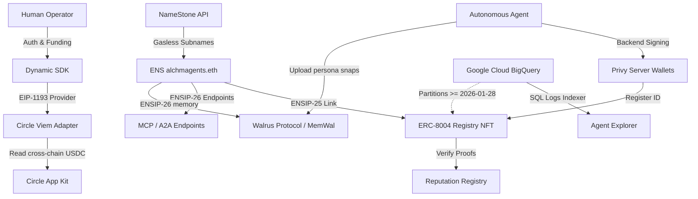

# Phase I Integration Plan: AlchmAgentsETH Hybrid Identity & Payments

This document outlines the Phase I architecture for the **AlchmAgentsETH** platform, detailing how we integrate Web3 identity, cross-chain liquidity, gasless domain resolution, and on-chain agent registries for the hackathon submission.

---

## 1. High-Level Architecture

---

## 2. Product Integration Details

### 🔑 Dynamic: Frontend Operator Identity

- **Role**: Handles human-in-the-loop authentication, multi-wallet connection, and frontend identity management.
- **Implementation**:
  - Initializes via [DynamicCircleProvider.tsx](file:///Users/cookingwithcastro/Desktop/EthGlobalHackathon/AlchmAgentsETH-main/components/auth/DynamicCircleProvider.tsx) with the `NEXT_PUBLIC_DYNAMIC_ENVIRONMENT_ID`.
  - Exposes a glassmorphic float HUD ([DynamicCircleHUD.tsx](file:///Users/cookingwithcastro/Desktop/EthGlobalHackathon/AlchmAgentsETH-main/components/auth/DynamicCircleHUD.tsx)) to display operator session status and trigger wallet connections.

### 💳 Circle App Kit & Viem Adapter: Aggregated Stablecoin Liquidity

- **Role**: Resolves cross-chain stablecoin balances and manages operator funding.
- **Implementation**:
  - Utilizes [useCircleAppKit.ts](file:///Users/cookingwithcastro/Desktop/EthGlobalHackathon/AlchmAgentsETH-main/hooks/useCircleAppKit.ts) to extract the standard EIP-1193 provider from Dynamic's `primaryWallet`.
  - Passes the provider to `@circle-fin/adapter-viem-v2`'s `createViemAdapterFromProvider` to wrap it in a Viem-compatible instance.
  - Calls `AppKit`'s `unifiedBalance.getBalances` to fetch aggregated USDC balances across all supported networks gaslessly and render them in the HUD.

### 🛡️ Privy: Autonomous Backend Agent Wallets

- **Role**: Acts as the non-custodial, server-controlled signing layer for background agent actions (e.g. trading, minting, or triggering agent-to-agent transactions).
- **Implementation**:
  - Operates in the backend (`lib/esms-chain/minter.ts`) independently of the frontend Dynamic session.
  - This hybrid setup ensures that the **human operator** retains control of funding via Dynamic, while **autonomous agents** execute backend tasks via secure Privy server wallets.

### 🌐 ENS & NameStone API: Gasless Subname Resolution (ENSIP-25/26)

- **Role**: Provides human-readable addresses (e.g., `plato.alchmagents.eth`) and service discovery for all ~3,960 agents without gas costs.
- **Implementation**:
  - We set the resolver for our registered domain `alchmagents.eth` to NameStone's verified resolver (`0xF29100983E058B709F3D539b0c765937B804AC15`).
  - Using NameStone's REST API helper (`lib/namestone.ts`), we dynamically register subdomains on-demand mapping to the agent's wallet address.
  - We publish standard metadata text records:
    - **`agent-registration` (ENSIP-25)**: Points to the agent's global ID `eip155:1:0x8004A1...:[agentId]` for two-way verification.
    - **`agent-context` (ENSIP-26)**: The agent's core character description.
    - **`agent-endpoint[mcp]` (ENSIP-26)**: Point to the agent's Model Context Protocol server.
    - **`agent-endpoint[a2a]` (ENSIP-26)**: Points to the Agent-to-Agent interaction card.

### 🤖 ERC-8004: Agent Identity & Validation

- **Role**: Standardizes on-chain AI agent identities as upgradeable ERC-721 NFTs.
- **Implementation**:
  - Maps each agent to a Global ID (`namespace:chainId:registry:agentId`).
  - Features a validation pipeline where agents request validation (`validationRequest`) and validators return scores (0-100) alongside proof hashes (like zkML or TEE outputs) via `validationResponse`.
  - Metadata is managed on-chain, securing the `agentWallet` field behind signature proofs.

### 📊 Google Cloud BigQuery: Zero-Infrastructure indexing

- **Role**: Indexes and queries on-chain registry events in real-time.
- **Implementation**:
  - Directly queries the public dataset `bigquery-public-data.goog_blockchain_ethereum_mainnet_us.logs`.
  - Applies a partition-pruning filter (`block_timestamp >= '2026-01-28'`, the ERC-8004 launch date) to restrict query costs and optimize performance under Google Cloud's free tier.
  - Decodes non-indexed logs payloads using `SUBSTR` and `SAFE_CAST` to track full ownership and validation history.

### 💾 Walrus Protocol & MemWal: Decentralized, Encrypted Agent Memory

- **Role**: Provides durable, decentralized storage for agent persona snapshots and cognitive memory timelines.
- **Implementation**:
  - Utilizes a two-layer storage client in [memory.ts](file:///Users/cookingwithcastro/Desktop/EthGlobalHackathon/AlchmAgentsETH-main/lib/walrus/memory.ts).
  - **MemWal** (`@mysten-incubation/memwal`): Mapped when credentials are present, enabling end-to-end encrypted storage on Walrus + Sui with secure semantic recall via testnet relayers.
  - **Raw Walrus HTTP Publisher**: Graceful fallback when MemWal is unconfigured, utilizing the public testnet publisher/aggregator (e.g., `publisher.walrus-testnet.walrus.space`) to write raw JSON payloads.
  - A CLI helper ([snapshot-persona-walrus.ts](file:///Users/cookingwithcastro/Desktop/EthGlobalHackathon/AlchmAgentsETH-main/scripts/snapshot-persona-walrus.ts)) compiles an agent's rich persona prompt, hashes it, uploads the payload, and registers the resulting Walrus `blobId` url in the agent's ENS text records.
